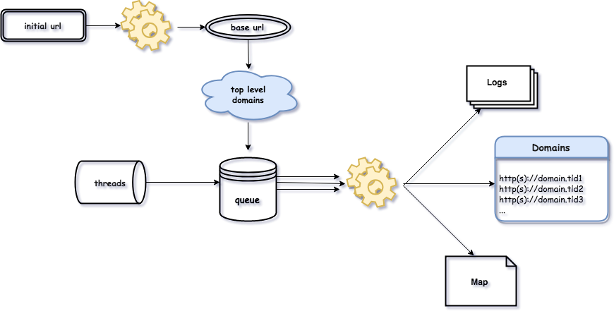

# TLDiscover [](https://github.com/chrispetrou/TLDiscover/blob/master/LICENSE)

**TLDiscover** is a __multi-threaded__ _top-level-domain fuzzer._ 

```bash
$ ./tldiscover.py -h
usage: tldiscover.py [-h] -u  [-t] [-v] [-a] [-l] [-m] [--timeout]

TLDdiscover Top level domain discovery.

arguments:
  -h, --help       show this help message and exit
  -u , --url       Specify a domain to start with.
  -t , --threads   Specify number of threads to use [default: None]
  -v, --verbose    Enable verbosity [default False]
  -a, --useragent  User a random user-agent [default False]
  -l, --log        Save the results in a log file [Default: False]
  -m, --map        Create a map [Default: False]
  --timeout        Specify HTTP connection timeout [default 10 sec]
  ```

The way it works can be best described by the following diagram:

<center></center>

It starts with a _base url_ and then attempts to find all the other possible urls, __following redirects__ if needed. Actually it performs exactly like a normal browser following redirects but it's way faster. In this way it is possible to discover other domains or in some special cases even subdomains. In the process it also extracts some basic info (_the title if provided_) for each page. The domains may not be related with each other.

> __Warning:__ It doesn't check, at least in the currect version, if the urls discovered are safe and It's exclusively the end user's responsibility:
>*   to use this tool/software
>*   how to handle the information this software/tool provides.

### <u>Example</u>

<center></center>

When `--map/-m` option is specified then a map is also created with every domains that is able to be resolved, as shown below:

<center></center>

### TODO
- [ ] Check how safe a discovered website might be (_using probably google safe browsing update API_) or at least estimate if it is considered legit.

### Disclaimer
>This tool is only for testing and academic purposes and can only be used where strict consent has been given. Do not use it for illegal purposes! It is the end user’s responsibility to obey all applicable local, state and federal laws. Developers assume no liability and are not responsible for any misuse or damage caused by this tool and software in general.

## License

This project is licensed under the GPLv3 License - see the [LICENSE](LICENSE) file for details