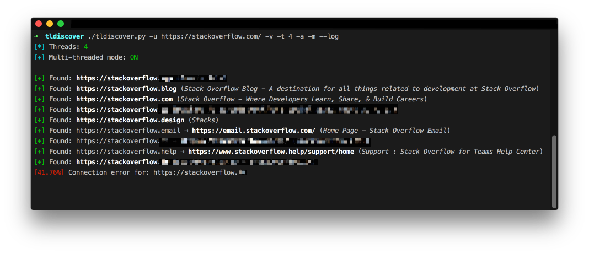
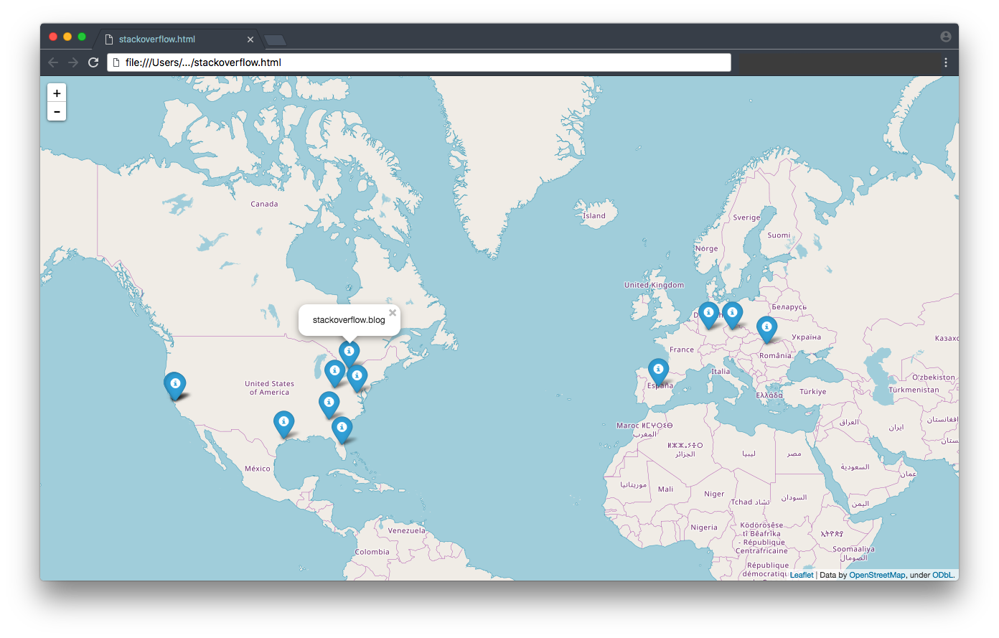

# TLDiscover 

**TLDiscover** is a __multi-threaded__ _top-level-domain fuzzer._ 

The way it works is simple. It starts with a _base url_ and then attempts to find all the other possible domains by fuzzing the _top-level-domain_, __following redirects__ if needed. Actually it performs exactly like a normal browser following redirects but it's way faster. In this way it is possible to discover other domains or in some special cases even subdomains. In the process it also extracts some basic info (_the title if provided and attempts geolocation & mapping if possible_) for each page. The domains found may or may not be related with each other.

> __Warning:__ It doesn't check, at least in the currect version, if the urls discovered are safe and It's exclusively the end user's responsibility:
>*   to use this tool/software
>*   how to handle the information this software/tool provides.

### <u>Example</u>

When `--map/-m` option is specified then a map is also created with every domains that is able to be resolved, as shown below:

### TODO
- [ ] Check how safe a discovered website might be (_using probably google safe browsing update API_) or at least estimate if it is considered legit.

**Note:** To install the requirements:

`pip install -r requirements.txt --upgrade --user`

### Disclaimer
>This tool is only for testing and academic purposes and can only be used where strict consent has been given. Do not use it for illegal purposes! It is the end user’s responsibility to obey all applicable local, state and federal laws. Developers assume no liability and are not responsible for any misuse or damage caused by this tool and software in general.

## License

This project is licensed under the GPLv3 License - see the [LICENSE](LICENSE) file for details